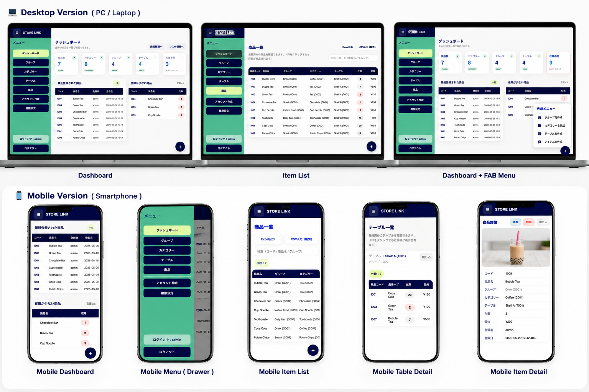
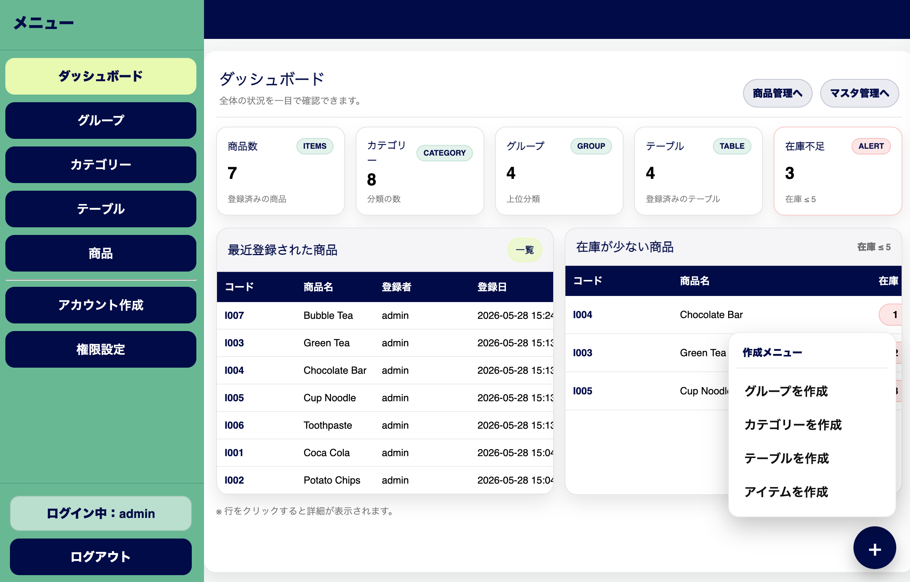
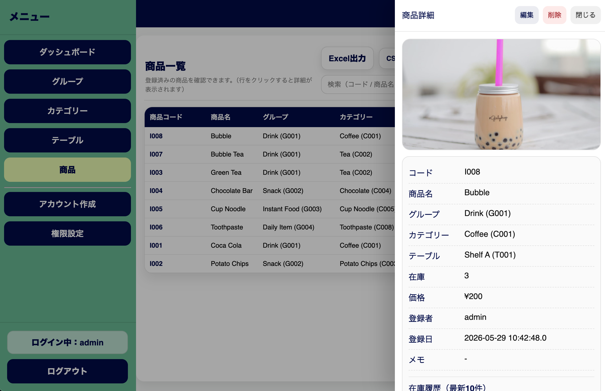
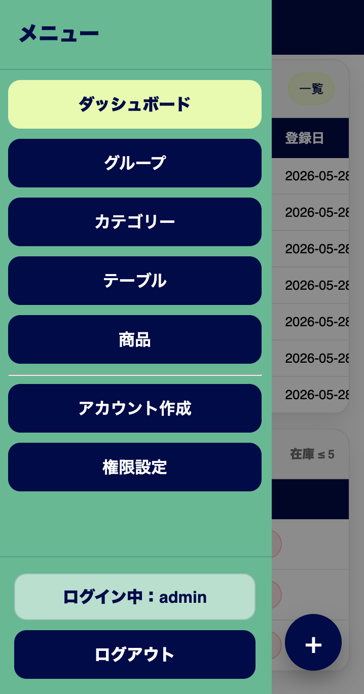
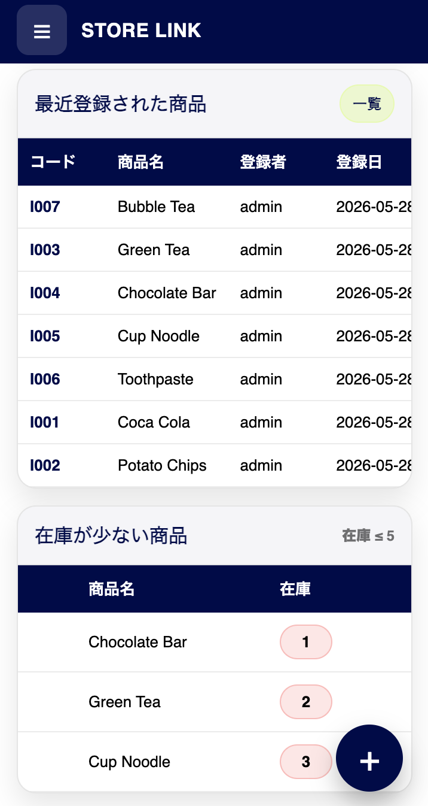
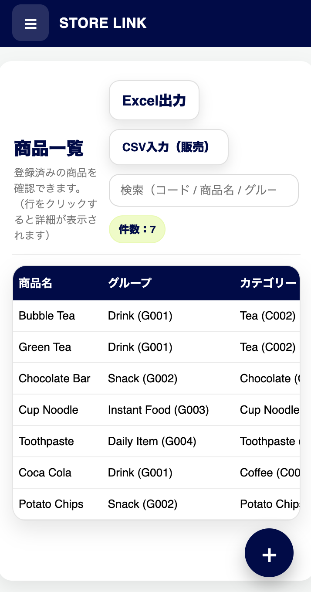
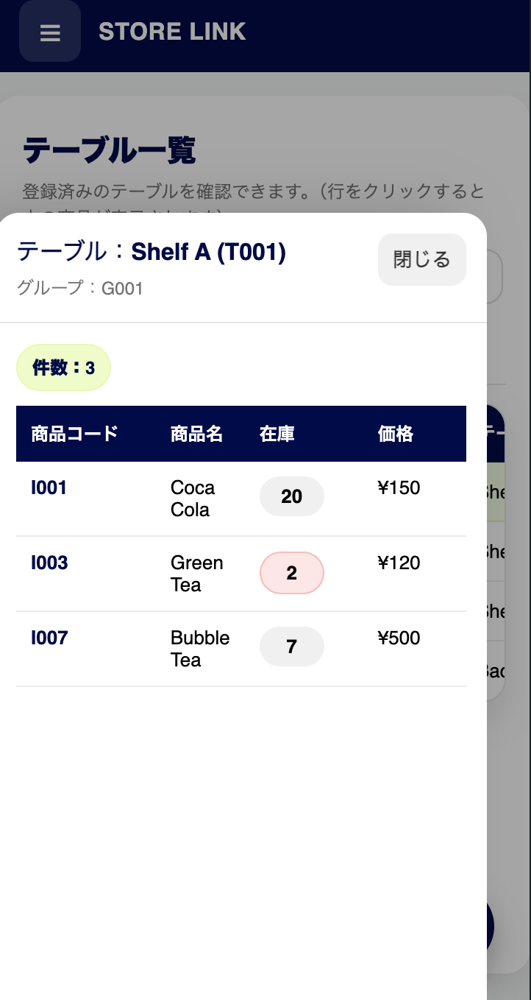
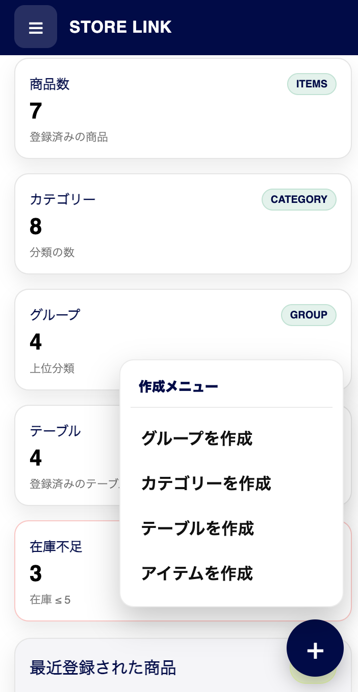
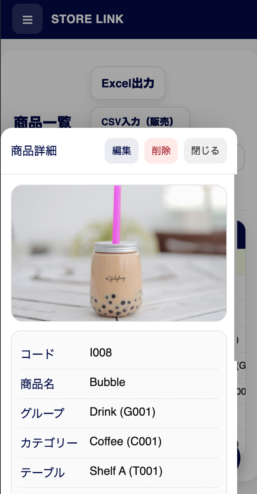

# 🏪 StoreLink

<p align="center">

</p>

コンビニでのアルバイト経験から、商品の場所や在庫状況を簡単に確認できるシステムとして開発しました。


## 📖 Overview

<table>
<tr>
<td width="50%" valign="top">

### 🇺🇸 English

StoreLink is a web-based inventory management system developed using Java Servlet, JSP, and MariaDB.

The system enables users to manage products, categories, groups, shelves, and inventory history efficiently.

It also supports CSV sales import, low-stock alerts, and responsive design for both desktop and mobile devices.

This project was inspired by inventory management challenges experienced while working at a convenience store.

</td>

<td width="50%" valign="top">

### 🇯🇵 日本語

StoreLinkは、Java Servlet・JSP・MariaDBを利用して開発した在庫管理Webシステムです。

商品、カテゴリー、グループ、棚情報、在庫履歴を効率的に管理できます。

また、CSV売上データ取込、在庫不足アラート、デスクトップ・スマートフォン対応機能を備えています。

コンビニエンスストアでのアルバイト経験の中で感じた在庫管理の課題を解決するために開発しました。

</td>
</tr>
</table>


<h2>🛠 Technology Stack</h2>

<p align="center">

</p>

<p align="center">
Java • Servlet • JSP • JDBC • MariaDB • Tomcat 9
</p>


# ✨ Features

<table>
<tr>
<td width="33%" valign="top">

## 📊 Dashboard

- Product Count
- Category Count
- Group Count
- Table Count
- Low Stock Alert
- Recent Products

</td>

<td width="33%" valign="top">

## 📦 Product Management

- Add Product
- Edit Product
- Delete Product
- Product Detail Panel
- Product Images

</td>

<td width="33%" valign="top">

## 📂 Category Management

- Create Category
- Edit Category
- Delete Category

</td>
</tr>

<tr>
<td valign="top">

## 👥 Group Management

- Create Group
- Edit Group
- Delete Group

</td>

<td valign="top">

## 🗂 Table Management

- Create Table
- Edit Table
- Delete Table
- Product Location

</td>

<td valign="top">

## 👤 User Management

- User Registration
- Permission Settings
- Role Management

</td>
</tr>

<tr>
<td valign="top">

## 📈 CSV Import

- Sales CSV Import
- Auto Stock Reduction

</td>

<td valign="top">

## 📤 Excel Export

- Export Product List
- Download Reports

</td>

<td valign="top">

## 🔒 Security

- Login Authentication
- Access Control
- Permission Check

</td>
</tr>
</table>


<h2>🖥 Desktop Version</h2>

<p align="center">



</p>


<h2>📱 Mobile Version</h2>

<p align="center">






</p>


## 🗄 Database

Database file included:

```sql
storelink.sql
```

Import:

```sql
CREATE DATABASE storelink;
USE storelink;
SOURCE storelink.sql;
```


## 👨‍💻 Developer

**Thura Hlaing Ko**

HAL Osaka  
Department of Information Technology

📧 Email  
thura1998.thk@gmail.com

💻 GitHub  
https://github.com/Thura2021


